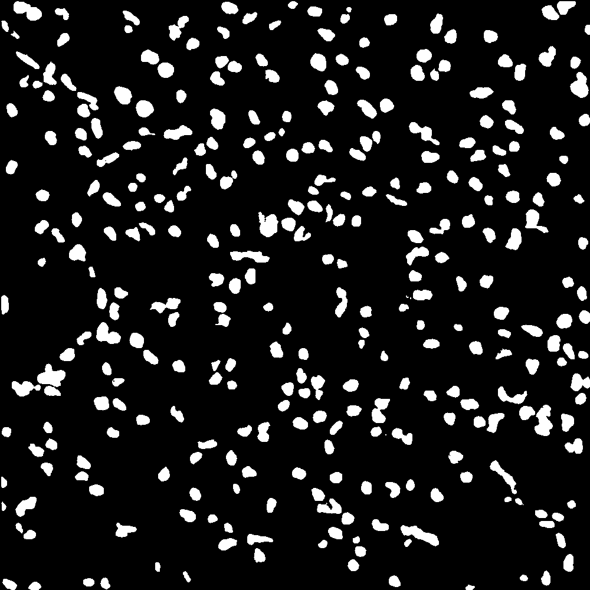

# Nuclei-Segmentation

Segment Nuclei from Medical Images using U-Net
---
## Requirement
- Opencv
- Python 3.6
- Tensorflow
- Keras (Tf backend)

## Data

The data used for training is from https://www.kaggle.com/c/data-science-bowl-2018/data

## How To Use

- Simply run nuclei-segmentation.py
- Image should be in *.png* format
- Accuracy is about 94.8%

## About
Unet is an auto-encoder used with medical image. I have used it for semantic segmentation and results are quite good.

## Sample Prediction
---
### Test Image

### Prediction

